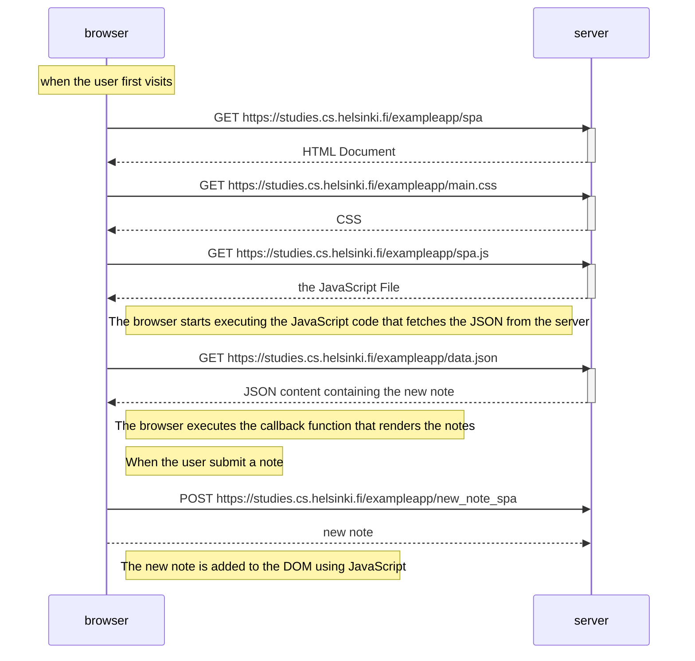

```mermaid
sequenceDiagram
    participant browser;
    participant server;
    Note over browser: when the user first visits

    browser->>server: GET https://studies.cs.helsinki.fi/exampleapp/spa
    activate server
    server-->>browser: HTML Document
    deactivate server

    browser ->> server: GET https://studies.cs.helsinki.fi/exampleapp/main.css
    activate server
    server-->>browser: CSS
    deactivate server

    browser ->> server: GET https://studies.cs.helsinki.fi/exampleapp/spa.js
    activate server
    server-->>browser: the JavaScript File
    deactivate server
    
    Note right of browser: The browser starts executing the JavaScript code that fetches the JSON from the server

    
    browser ->> server: GET https://studies.cs.helsinki.fi/exampleapp/data.json
    activate server
    server-->>browser: JSON content containing the new note
    deactivate server

    Note right of browser: The browser executes the callback function that renders the notes
    note right of browser: When the user submit a note
    
    browser ->> server: POST https://studies.cs.helsinki.fi/exampleapp/new_note_spa
    browser-->>server: new note

    note right of browser: The new note is added to the DOM using JavaScript


```